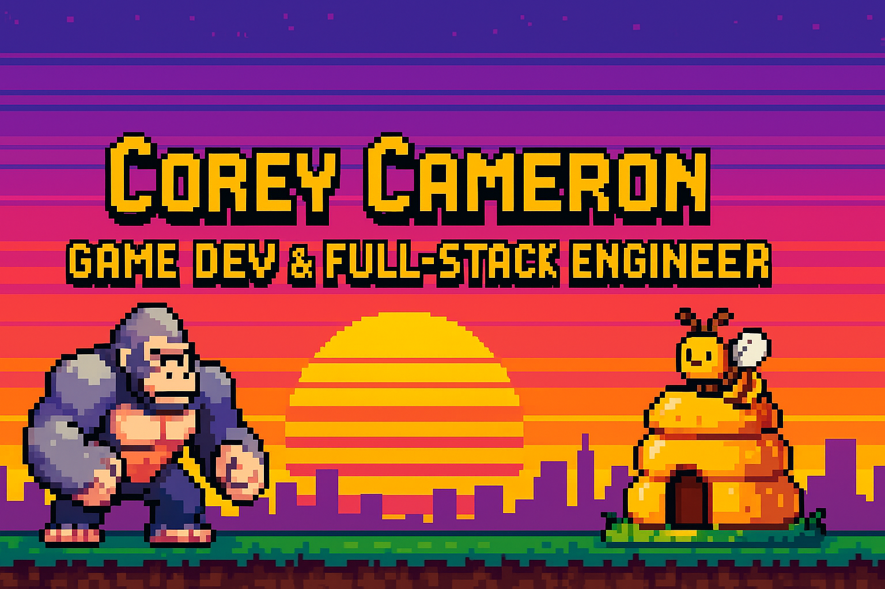

  

<h1 align="center">Hi 👋, I'm Corey Cameron</h1>
<h3 align="center">🎮 Game Developer | 💻 Full-Stack Engineer | 🚀 Passionate Creator</h3>

  Building immersive games and intuitive web apps with creativity and precision.

---

### 🚧 Current Projects

- **🎮 [Primal Instinct](https://github.com/nottmonk/roblox-gorilla-ai)**  
  Roblox boss battle game featuring a reactive AI Gorilla enemy powered by Lua scripting.

- **🐝 [Buzz Defense](https://github.com/nottmonk/bee-tower-defense)**  
  Godot-based tower defense game where players defend their hive with bee armies.

---

### 📁 Past Projects

- **🏬 [Dollar General Recreate](https://github.com/nottmonk/DG-Redesign)**  
  A complete UI/UX revamp of the Dollar General site using the MERN stack.

---

### 🤝 Let’s Connect

- 💬 Ask me about **JavaScript**, **Game AI**, or **Full-Stack Dev**
- 📬 Reach me at: **coreycameron26@gmail.com**

  
  

---

### 🛠️ Languages & Tools

  
  
  
  
  
  
  
  
  

---

### 📊 GitHub Stats

  

---

### 🐝 Featured Sprite

  

